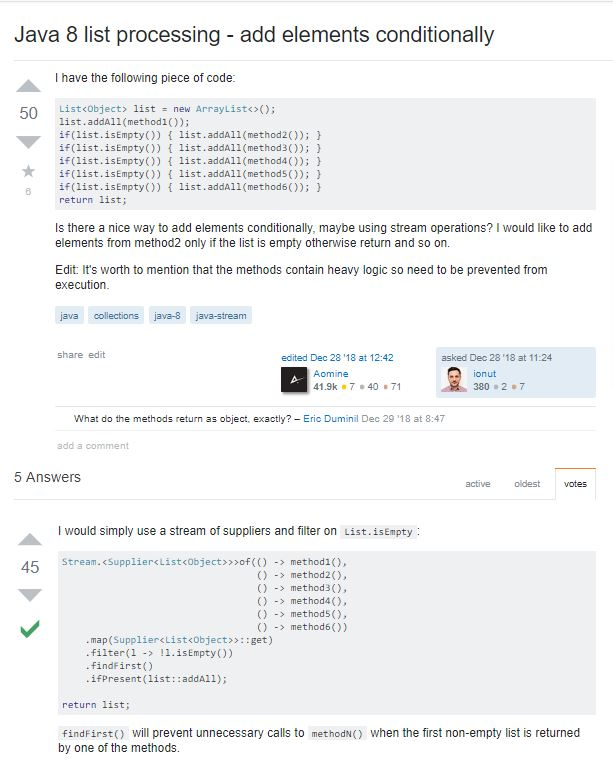
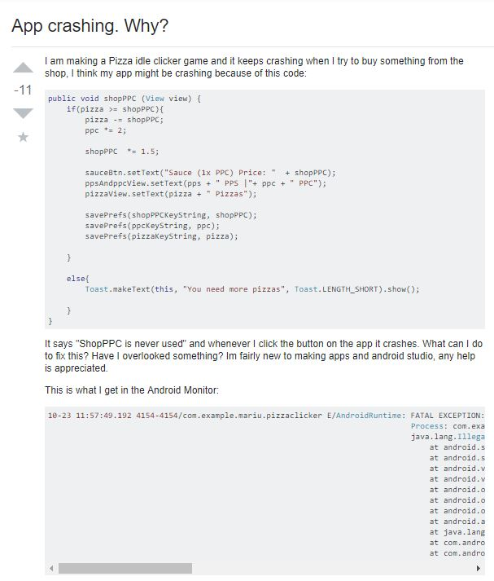
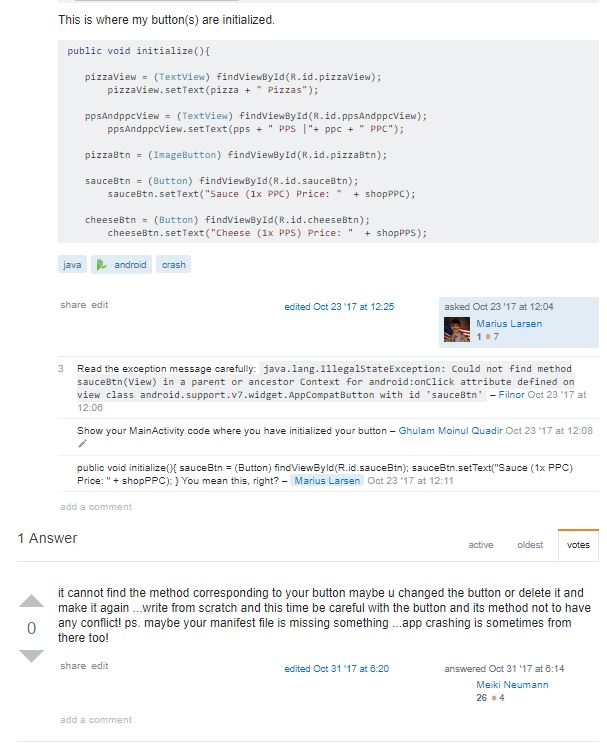

## Questions, Please

Asking a question as a developer can be one of the hardest things to do correctly. I know for myself, I start off every project wanting to do it entirely on my own. The thing is, several hours into a difficult problem that mentality tends to change very quickly. I get to a state of mental exhaustion with a  bug or malfunction where I just want to put the whole thing on the internet and see who is willing to help. It is easy to look for that out when you know that places like Stack Overflow exist.

The thing is, a lot of stuff I have done as a student is only relevant to other students. As a student, I also haven’t really been on the other side of the equation; I don’t have a lot of expertise to share. These factors can lead to a lot of bad questions by students in these online forums. Truly basic questions, questions that already have well documented resolutions, poorly phrased questions, questions asked in the wrong place...all of these are common problems to see. 

## So What Can A Smart Question Get You?

Posting a great, intriguing question can fix your problems while also teaching you something new. I think in most cases, that is what everyone asking a question strives for, but execution varies wildly. Take the post below as an example, this is what you want:

There are a few specific parts of this successful question to point out:
The title follows the “object-deviation” header convention, this allows anyone viewing the question to instantly know whether or not they have experience in the area. “Hey, i know all about list processing in Java 8, i’ll take a look,” is the desired outcome. 
Not only was the subject of the question well put, but relevant tags were added to properly filter the question to the best audience for it.
The author has included the exact code snippet that they have already created with a method of solving the problem, but one that they wish to improve on. This means readers don’t have to recreate anything, saving them time. 
The author edited in additional information, indicating they were monitoring this in realtime and saw that they could head off the first question many people ask with additional information in the original post.

The way the previous question was asked got a fully explained, useful answer in about 20 minutes, just about the best case scenario possible. So what happens when you don’t make good choices in asking your question?

## Turns Out, There Is Such A Thing As A Bad Question

As you will see, the following example comes from none other than a student. Unfortunately for Marius, he did not receive the help that he needed, although those answering tried to be constructive, more than some would say he deserved.

So in contrasting the above question with our previously discussed successful question, a lot jumps out right away. We can say that, to his credit, Marius provided code samples, however these samples are just a guess as to where the problem lies. There is who knows how much code not shared and one must just take his word that anything in the snippets is relevant to the error. Past this, the title of the post is particularly terrible for attracting useful help. “App Crashing. Why?” provides almost zero useful information. Just to give a quick synopsis of what it does not provide:
Platform
Programming Language
Conditions for crash

Those three things are basically the holy trinity of what information is necessary to even start debugging. The tags give us a bit of information (Java, android, crash) however they still leave you wanting. 

Unsurprisingly, Marius does not get much help from this question. There is only one top level response and it comes eight days after the question was posed. The responses he does get can only guess at the problem themselves, really the answer is for Marius to do his due diligence debugging. The errors provided by Java can be quite descriptive in identifying the problem, and this is what the responses primarily try to point out. 

## Results Of This Short Case Study

After this “scientific” study with a sample size of two, there are some conclusions that can be haphazardly drawn. First is that a title is important for visibility, and this is paramount for targeting your audience as well. Secondly, when including code make sure that you aren’t inserting an epic novel, keep it short, sweet and relevant. Lastly, put the work in, people want to help those that help themselves, and detailing your attempts at the solution or debugging prevents redundant work by those trying to help. 
