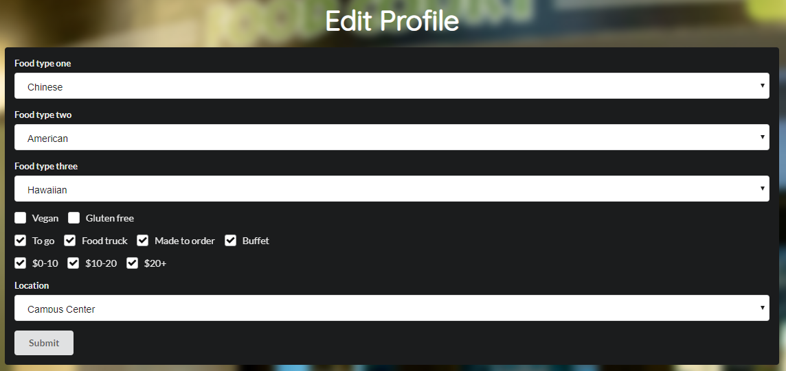
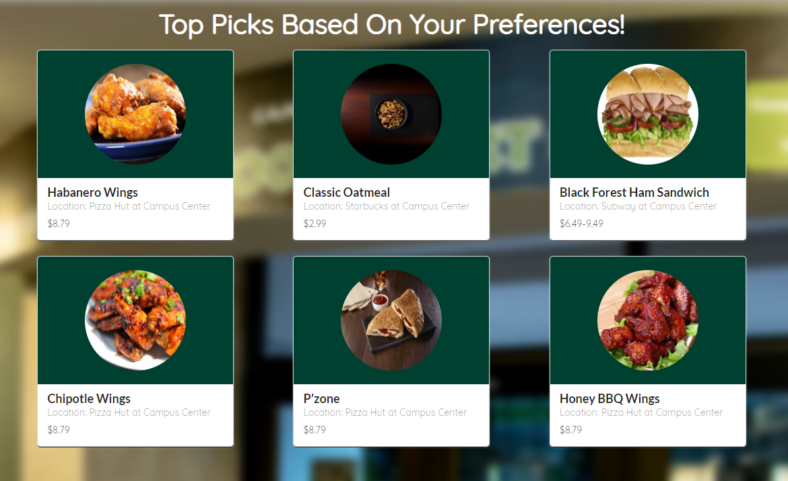

Manoa Munchies is a webapp created along with a team of four other ICS students to serve the UH Manoa community. The idea was to connect students and anyone else on campus with the campus dining options that would best suite their needs and wants. The project was built over the course of about a month using a combination of Meteor and Semantic UI React and deployed on the Meteor Galaxy hosting service. The image below shows the user profile page, where self-identified customers will choose which types of food they are interested in, and where. From this profile, a "Top Picks" page was generated, matching student preferences with vendor offerings. Vendors are able to create their own accounts on the site to add their restaurants and menus. 

I did a mix of work throughout the course of the project, dabbling in all areas. Initially I created the MongoDB collections we used for user preferences and Vendor attributes. I implemented functionality for several pages including top picks, the user profile page, and the sign up form. I spent a lot of time on the backend aspects of the system, making sure that users were differentiated by the "customer" and "vendor" roles and all of the collections could work properly together. It was also my responsibility to verify and deploy each release to Galaxy. 

This project was my first time creating an app as large as this and it was a great experience. I had many issues crop up that I never would have guessed; you just can't prepare for the side effects of this many "moving parts" without doing it. I really enjoyed using Semantic UI React which had excellent documentation, and then I got the opposite end of the spectrum using some more niche components that had very poor documentation. It made me really value good documentation in a way that I hadn't previously. In the end it was rewarding to work on something I think people would actually use, given some more time invested. 

  
### [Github Repository](https://github.com/munchyco/manoa-munchies)
### [Documentation](https://munchyco.github.io/)

